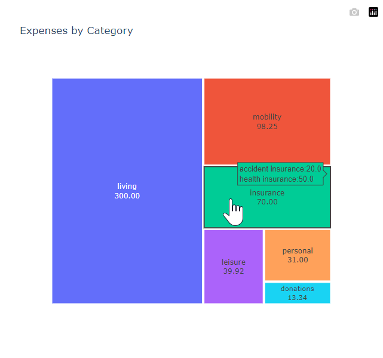
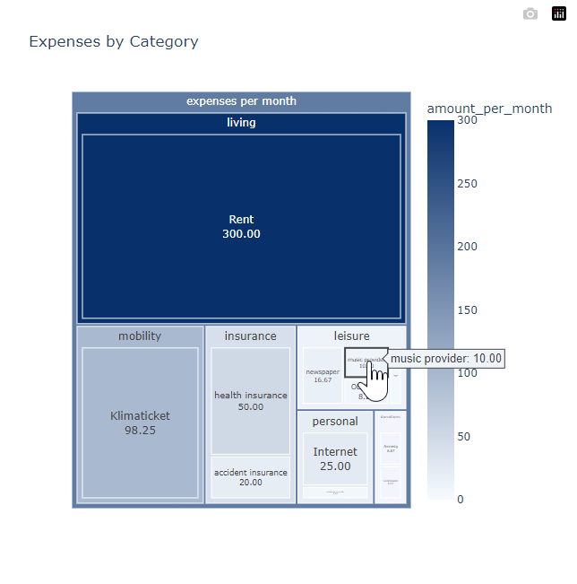

# Thrifty Panda

A simple expense tracking and visualization tool using pandas, plotly and sqlite3 to keep track of my monthly expenses.

## Motivation

I wanted to have a simple tool to better understand, and ideally reduce, my fixed costs 

## Features

- Export monthly expenses to a markdown table
- Visualize expenses with a treemap 

|  | 
|:-----------------------------------------------------------------:|
|                 Monthly Expenses Treemap Example                  |

|  | 
|:-------------------------------------------------------------------:|
|   Monthly Expenses Treemap Example including individual expenses    |


## Usage

Initialize the project:

```shell
./init.sh
```

Create treemaps:

```shell
python src/vis.py
```

Export monthly expenses to markdown:

```shell
./update_monthly_expenses_md.sh
```

## Requirements

- Python 3.13+
- Pandas
- uv
- Plotly
